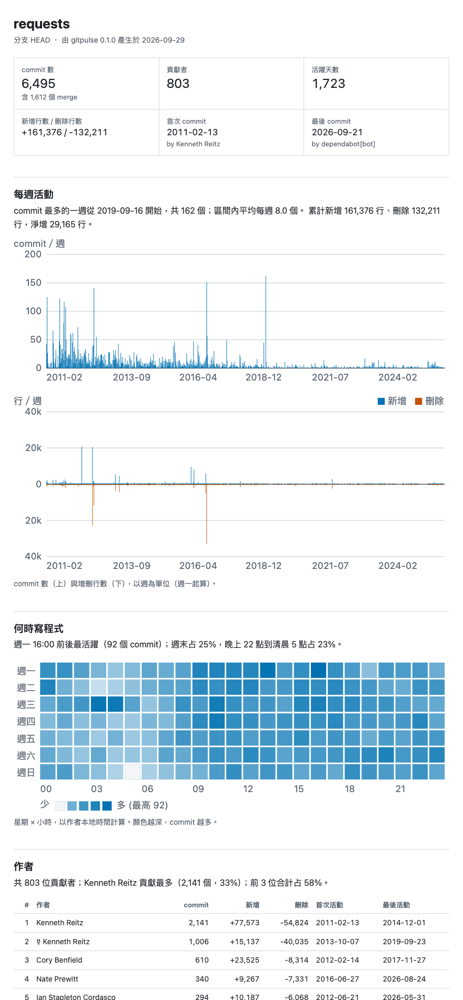
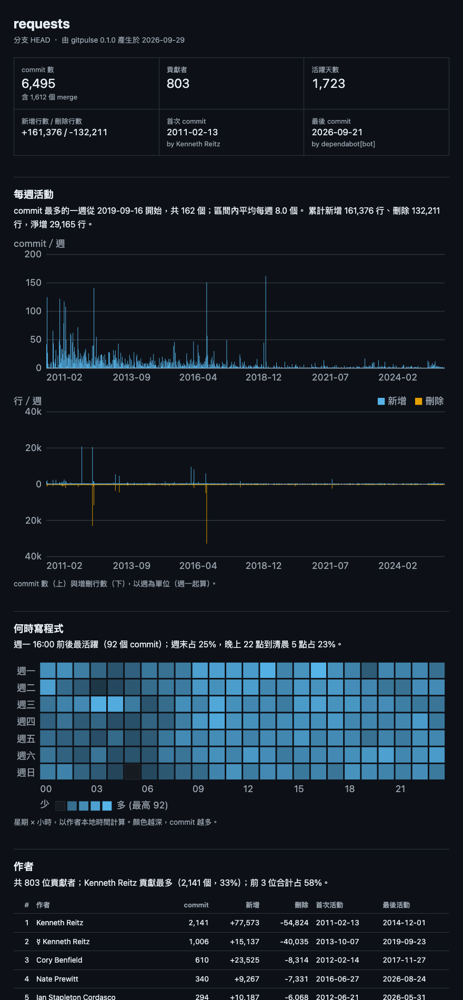

# gitpulse

Turn any git repo's history into a single-file HTML analysis report.

gitpulse 是一個命令列小工具：指向任何一個 git 專案，它會讀完整段 commit 歷史，產生一份**單一 HTML 檔**的分析報告。圖表全部是用 Python 自己畫的內嵌 SVG，不需要網路、不用任何 JavaScript 圖表函式庫，整個專案**零第三方依賴**（只用 Python 標準函式庫和你電腦上的 `git`）。



深色模式會跟著系統設定自動切換：



完整範例報告在 [`docs/example-report.html`](docs/example-report.html)，下載後用瀏覽器打開即可。範例資料來自公開專案 [psf/requests](https://github.com/psf/requests)（Apache-2.0）的完整 git 歷史，僅作為示範。

## 功能

- 概覽：commit 數、貢獻者、活躍天數、增刪行數、首次／最後 commit
- 每週 commit 數，以及每週新增／刪除行數
- 星期 × 小時熱力圖（依作者本地時區）
- 作者排行：commit、增刪行、首次／最後活動；同一人的不同名稱或信箱用 `.mailmap` 合併
- 檔案熱點：修改次數最多、改動行數最多的檔案；各頂層目錄的 churn
- 語言分布：依副檔名，統計目前版本的文字檔行數（二進位檔不計）
- Bus factor：每個頂層目錄要幾位作者才涵蓋 80% 的改動
- commit 訊息：平均標題長度、conventional commit 類型分布、最常見的開頭詞
- 每張圖都附一句自動產生的重點文字，數字有千分位，配色為色盲友善的藍／橘
- 支援淺色／深色模式、手機寬度不會水平捲動、可切換繁體中文或英文
- 能處理：檔名有空白或中文、重新命名（rename 會沿著歷史合併）、二進位檔、merge commit、空 repo、shallow clone
- `--json` 可輸出原始統計，方便自己再加工

## 安裝

需要 Python 3.10 以上與 git。打開終端機（Mac：「終端機」App；Windows：PowerShell）：

先檢查版本：

```bash
python3 --version
git --version
```

方法一，用 [pipx](https://pipx.pypa.io/)（推薦，不會弄髒系統的 Python）：

```bash
pipx install git+https://github.com/useless-husband/gitpulse
```

方法二，用 [uv](https://docs.astral.sh/uv/)：

```bash
uv tool install git+https://github.com/useless-husband/gitpulse
```

方法三，不安裝，直接下載後執行：

```bash
git clone https://github.com/useless-husband/gitpulse
cd gitpulse
python3 -m gitpulse --help
```

## 使用

在任何一個 git 專案的資料夾裡：

```bash
gitpulse -o report.html
```

然後用瀏覽器打開 `report.html`（Mac 可輸入 `open report.html`）。

也可以指定路徑與範圍：

```bash
# 分析別的資料夾，只看 2025 年，排除 vendor 目錄，輸出英文報告
gitpulse ~/code/my-project -o report.html --since 2025-01-01 --until 2025-12-31 \
  --exclude 'vendor/*' --lang en

# 只分析 main 分支
gitpulse . --branch main -o report.html

# 輸出原始統計（JSON）
gitpulse . --json > stats.json
```

| 參數 | 說明 |
| --- | --- |
| `repo` | 專案路徑，預設為目前資料夾 |
| `-o, --output` | 輸出檔，預設 `report.html`（搭配 `--json` 時預設印到標準輸出） |
| `--since`, `--until` | 日期範圍，例如 `2025-01-01`；`--until` 含當天 |
| `--branch` | 要分析的分支或 revision，預設 `HEAD` |
| `--exclude GLOB` | 排除符合的路徑，可重複使用，例如 `'vendor/*'`、`'*.lock'` |
| `--lang zh\|en` | 報告語言，預設 `zh` |
| `--json` | 輸出 JSON |
| `-q, --quiet` | 不印進度訊息 |

### 實際輸出範例

分析 psf/requests（6,495 個 commit）：

```console
$ gitpulse requests -o report.html
reading history of requests (HEAD)...
  2000 commits parsed
  4000 commits parsed
  6000 commits parsed
  6495 commits parsed
counting lines per language...
wrote report.html
```

進度訊息輸出到 stderr，所以 `--json` 的內容不會被污染。報告裡每個區塊上方都有一句重點，例如：

- 每週活動：「commit 最多的一週從 2019-09-16 開始，共 162 個；區間內平均每週 8.0 個。」
- 熱力圖：「週一 16:00 前後最活躍（92 個 commit）；週末占 25%，晚上 22 點到清晨 5 點占 23%。」
- 語言：「Python 占 42.7%（12,032 行）；共 13 種語言。」

`--json` 的部分輸出（以本專案的測試 repo 為例）：

```json
{
  "overview": { "commits": 6, "merges": 1, "authors": 2, "active_days": 5, "added": 27, "deleted": 0 },
  "bus_factor": { "overall": 2, "threshold": 0.8 }
}
```

## 專案結構

```
gitpulse/
├── gitpulse/
│   ├── cli.py        命令列參數與輸出
│   ├── collect.py    呼叫 git、串流解析、統計彙整
│   ├── langs.py      副檔名對應語言
│   ├── svg.py        SVG 圖表元件（刻度、比例尺、長條、熱力圖）
│   ├── report.py     組出完整 HTML（CSS、表格、少量原生 JS）
│   └── i18n.py       中／英文字串
├── tests/            unittest 測試（含用暫存 git repo 的整合測試）
├── docs/             截圖與範例報告
└── .github/workflows/ci.yml
```

## 跑測試

```bash
python3 -m unittest discover -s tests -v
```

測試會用 `tempfile` 建立暫存 git repo，並用固定的作者與 `GIT_AUTHOR_DATE` 寫腳本化 commit（含中文檔名、有空白的檔名、rename、二進位檔、merge、shallow clone、`.mailmap`），再驗證統計數字。SVG 產生器（刻度、座標）與 HTML 輸出（可被 `html.parser` 解析、沒有外部資源）也有測試。

## 原理簡介

1. 執行一次 `git log --numstat -z -M --format=...`。欄位之間用 `0x1f`、commit 之間用 `0x01` 分隔，檔名用 NUL 結尾（`-z`），所以檔名裡有空白、中文或引號都不會解析錯。
2. 輸出以 1 MB 為單位串流讀取，每解析完一個 commit 就併入統計然後丟掉，不會把整段輸出存在記憶體裡，上萬個 commit 也只需要幾秒。
3. git 是從新到舊輸出歷史，所以遇到 rename 時，記下「舊路徑 → 新路徑」，之後（較舊）的 commit 就自動算到新路徑上。
4. 作者名稱由 git 依 `.mailmap` 轉換。熱力圖的星期與小時直接取作者當時的本地時間。
5. 語言行數用 `git grep -I -c` 對目前版本計算（`-I` 略過二進位檔）。
6. Bus factor：把某目錄的改動行數依作者由多到少排序，累加到 80% 需要幾位作者。
7. SVG 用字串組出來，顏色都寫成 CSS 變數，所以淺色／深色共用同一份圖；tooltip 與表格排序是幾十行原生 JS。

## 已知限制

- 統計的是「改動行數」不是「存活行數」，不做 blame。
- 語言分布只看目前版本；若使用 `--exclude`，也會套用到語言統計。
- merge commit 算入 commit 數與作者活動，但不計入增刪行數（git 預設不對 merge 產生 numstat）。
- 已知的縮寫或機器人帳號不會自動過濾。

## 授權

[MIT](LICENSE) © 2026 useless-husband
